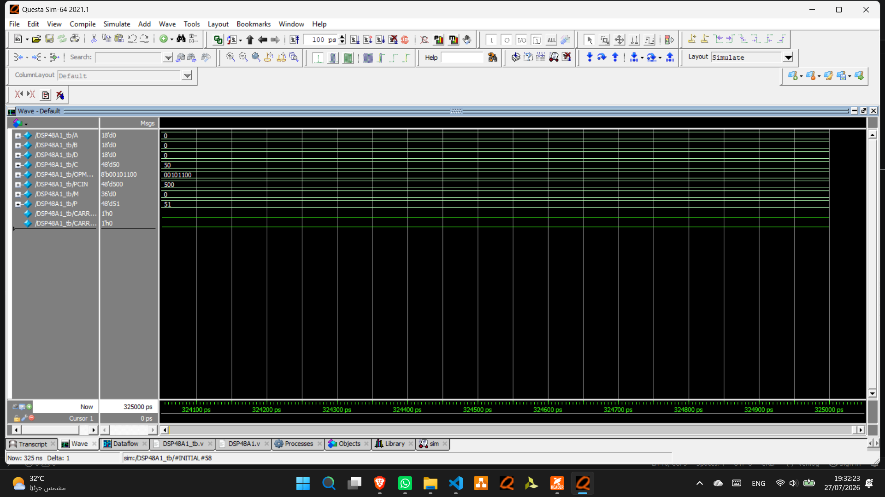
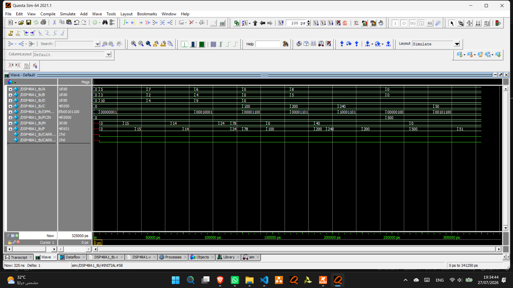
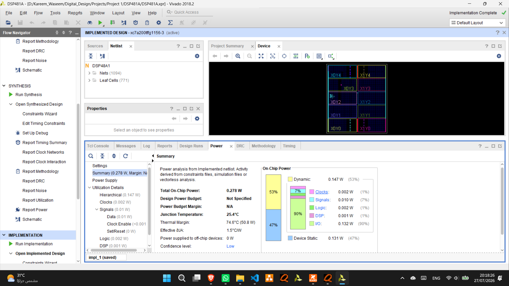

# DSP48A1 Verilog Implementation

## Overview

This project implements the Xilinx DSP48A1 slice using Verilog HDL.

The design was verified through simulation using ModelSim/QuestaSim and synthesized using Xilinx Vivado.

---

## Features

- Verilog RTL implementation
- Functional verification using a Verilog testbench
- Simulation using ModelSim / QuestaSim
- Synthesis using Xilinx Vivado
- XDC constraints file
- Simulation script (.do)

---

## Tools Used

- Verilog HDL
- ModelSim / QuestaSim
- Xilinx Vivado

---

## Project Structure

| File | Description |
|------|-------------|
| DSP48A1.v | RTL Design |
| DSP48A1_tb.v | Testbench |
| run.do | Simulation Script |
| DSP48A1.xdc | Constraints File |
| Project 1.pdf | Project Report |

---

## Results

### RTL Schematic

!# DSP48A1 Verilog Implementation

## Overview

This project implements the Xilinx DSP48A1 slice using Verilog HDL.

The design was verified through simulation using ModelSim/QuestaSim and synthesized using Xilinx Vivado.

---

## Features

- Verilog RTL implementation
- Functional verification using a Verilog testbench
- Simulation using ModelSim / QuestaSim
- Synthesis using Xilinx Vivado
- XDC constraints file
- Simulation script (.do)

---

## Tools Used

- Verilog HDL
- ModelSim / QuestaSim
- Xilinx Vivado

---

## Project Structure

| File | Description |
|------|-------------|
| DSP48A1.v | RTL Design |
| DSP48A1_tb.v | Testbench |
| run.do | Simulation Script |
| DSP48A1.xdc | Constraints File |
| Project 1.pdf | Project Report |

---

## Results

### RTL Schematic

### Waveform

### Waveform 2

### Implementation

---

## Author

**Abdel Rahman Salah**

